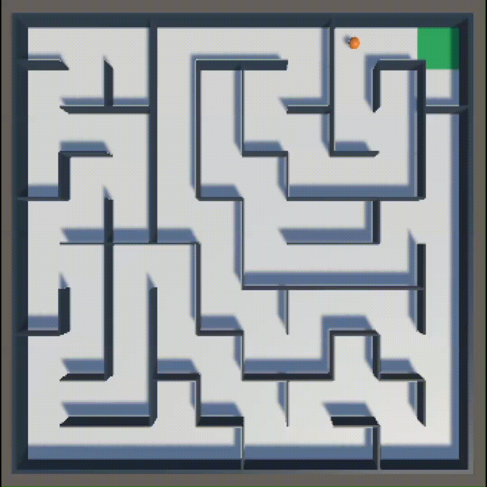
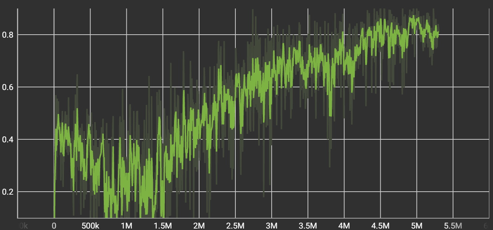
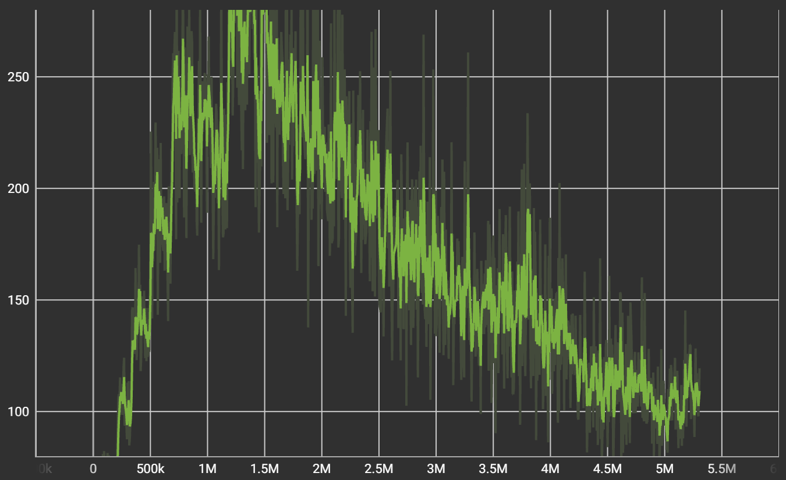
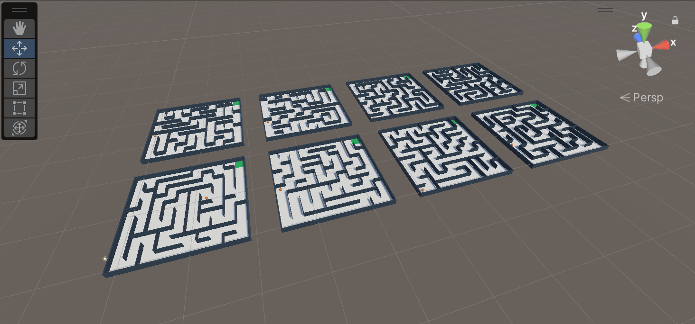

# maze-rl-3d



A reinforcement learning agent trained to solve procedurally generated mazes, with real-time 3D visualization in Unity. The agent learns using PPO with LSTM memory and a custom curriculum that progressively scales maze complexity from 3×3 to 10×10.

**98% success rate on 10×10 mazes — trained from scratch in ~2.5 hours.**

---

## Results

| Metric | Value |
|---|---|
| Final success rate | 98% |
| Maze size at convergence | 10×10 |
| Average steps to solve (10×10) | ~100 |
| Total training steps | 5.3M |
| Training time | ~2.5 hours |
| Parallel training environments | 8 |

### Training curves

| Cumulative reward | Episode length |
|---|---|
|  |  |

The reward curve shows the agent progressing through curriculum stages. Episode length decreasing over time reflects the agent learning shorter, more efficient paths.

---

## System architecture

```
Unity (C#)                          Python
──────────────────                  ──────────────────
MazeGenerator.cs                    
Procedural maze (DFS)               
                                    
MazeAgent.cs          ──────────→   ML-Agents receives state
8 observations                      PyTorch runs neural net
LSTM memory                         PPO updates weights
                      ←──────────   returns action
RewardSystem.cs
Efficiency-based rewards
CurriculumManager.cs
3×3 → 10×10 auto-scaling
                                    TensorBoard logs metrics

On completion:
Python exports model.onnx → Unity runs inference without Python
```



---

## How it works

### Maze generation

Mazes are generated using the **Recursive Backtracker (DFS)** algorithm. Each maze is a perfect maze — exactly one path exists between any two cells, with no inaccessible zones. Generation is seed-controlled, so the same seed always produces the same maze.

### Reinforcement learning

The agent uses **PPO (Proximal Policy Optimization)** with an **LSTM layer** that gives it memory across timesteps — essential for navigating mazes without revisiting dead ends.

**Observations (8 inputs per step):**

```
[pos_x, pos_z, wall_N, wall_S, wall_E, wall_W, dist_row, dist_col]
```

**Action space:** 4 discrete actions — North, South, East, West.

**Reward design:**

```
+1.0 + efficiency bonus   reach the exit (bonus scales with speed)
-0.01                     per step (encourages shorter paths)
-0.10                     returning to the immediately previous cell
-1.0                      episode timeout
```

### Curriculum learning

`CurriculumManager.cs` automatically scales maze difficulty during training:

- Starts at 3×3
- Advances to the next size when success rate ≥ 70% over 300 episodes
- Downgrades if success rate falls below 30%
- Reaches 10×10 as final stage

8 environments train simultaneously, each with a different random seed per episode.

---

## Project structure

```
maze-rl-3d/
├── maze_generator/
│   ├── maze.py              — MazeCell + Maze (recursive backtracker)
│   ├── visualizer.py        — ASCII terminal visualizer
│   ├── solvers/
│   │   ├── astar.py         — A* solver (baseline)
│   │   └── bfs.py           — BFS solver (baseline)
│   └── tests/
│       └── test_maze.py     — 23 unit tests
├── unity-project/
│   └── Assets/
│       ├── Models/          — trained .onnx model
│       ├── Scenes/
│       │   └── MainScene.unity
│       └── Scripts/
│           ├── MazeGenerator.cs
│           ├── MazeCell.cs
│           ├── MazeAgent.cs
│           ├── RewardSystem.cs
│           └── CurriculumManager.cs
├── training/
│   ├── config/
│   │   └── maze_trainer.yaml
│   └── models/
│       └── maze_agent_v1_10x10_90pct.onnx
├── docs/
│   └── img/
├── requirements.txt
└── README.md
```

---

## Tech stack


| Tool | Role |
|---|---|
| Python 3.10 | Maze generator, solvers, tests |
| C# / Unity 2022 LTS | 3D scene, agent, curriculum |
| ML-Agents 1.1.0 | Unity ↔ Python RL bridge |
| PyTorch 2.2.1 | Neural network (managed by ML-Agents) |
| PPO + LSTM | Training algorithm + memory |
| TensorBoard | Training metrics |
| ONNX | Exported model format |
| pytest | 23 unit tests |

---

## Running the project

### Requirements

```bash
git clone https://github.com/ricardohueto/maze-rl-3d.git
cd maze-rl-3d
python -m venv venv
source venv/Scripts/activate  # Windows
pip install -r requirements.txt
```

### Run the Python maze generator

```bash
python -m maze_generator.visualizer
```

### Run tests

```bash
python -m pytest maze_generator/tests/test_maze.py -v
```

### Watch the trained agent in Unity

1. Open `unity-project/` in Unity 2022.3 LTS
2. In each `MazeAgent` GameObject → `Behavior Parameters` → drag `training/models/maze_agent_v1_10x10_90pct.onnx` into the **Model** field
3. Set **Behavior Type** to `Inference Only`
4. Set `startSize = 10` and `maxSize = 10` in `CurriculumManager`
5. Press Play

### Train from scratch

```bash
source venv/Scripts/activate
export CUDA_VISIBLE_DEVICES=""
mlagents-learn training/config/maze_trainer.yaml --run-id=maze_run_01
```

---

## Roadmap

- [x] Phase 0 — Setup, GitHub repo, Python environment
- [x] Phase 1 — Python maze generator (recursive backtracker)
- [x] Phase 2 — Unit tests (23 passing)
- [x] Phase 3 — A* and BFS solvers as baselines
- [x] Phase 4 — Unity + ML-Agents setup
- [x] Phase 5 — 3D maze generator in Unity
- [x] Phase 6 — RL agent (observations + reward system)
- [x] Phase 7 — Training with curriculum learning (3×3 → 10×10)
- [x] Phase 8 — Documentation and README

---

## License

MIT — see [LICENSE](LICENSE)
